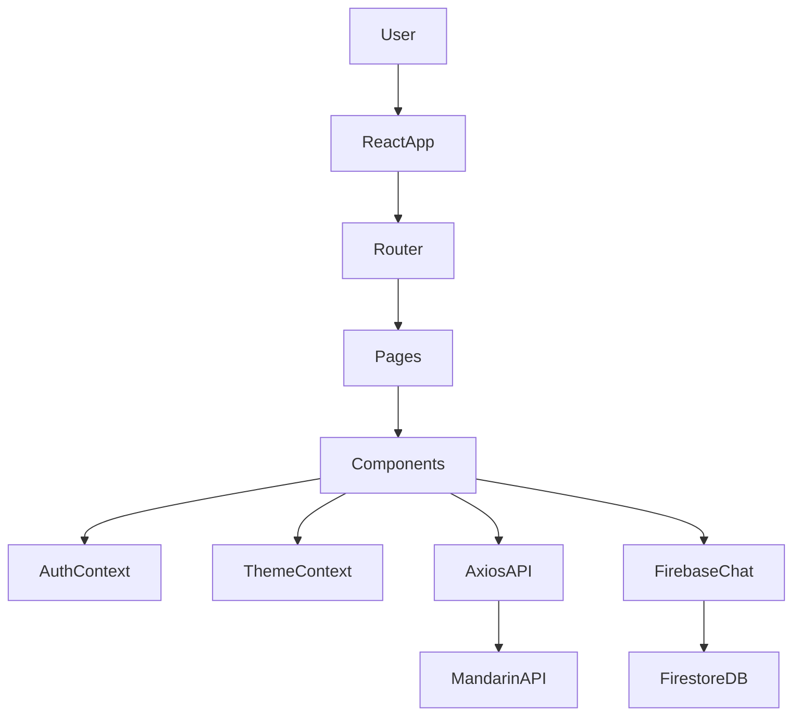
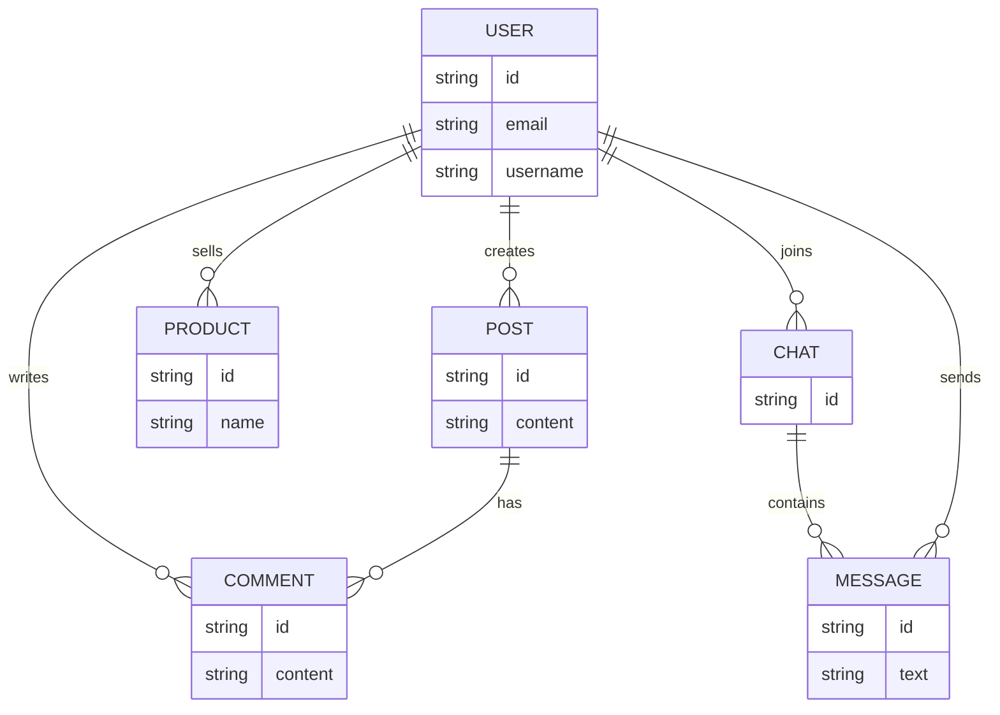
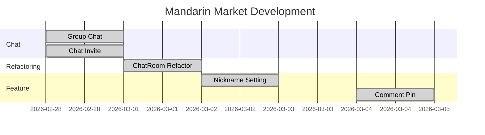

# 🍊 Mandarin Market (감귤마켓)

<p align="center">

</p>

<p align="center">


SNS형 피드 + 중고거래 + 실시간 채팅을 결합한 **모바일 퍼스트 웹 앱**입니다.  
게시글/상품 CRUD, 팔로우/검색, 그리고 **Firebase Firestore 기반 채팅(1:1/그룹/리액션/핀/테마)**을 제공합니다.

> **Design**: Mobile-first / max-width 390px  
> **API Base**: `https://dev.wenivops.co.kr/services/mandarin`  
> **AI Proxy**: `https://dev.wenivops.co.kr/services/openai-api`

---

## Team

| 이름 | 역할 |
|-----|-----|
| 강민기 | Frontend |
| 박미소 | Frontend |
| 백동명 | Chat / Post |
| 변슬기 | Chat System |
| 손은애 | Profile / Docs |

---

## 목차
- [목표](#목표)
- [배포](#배포)
- [코드 품질 관리](#코드-품질-관리)
- [기술 스택](#기술-스택)
- [핵심 기능](#핵심-기능)
- [주요 기능 GIF](#주요-기능-gif)
- [Screenshots](#screenshots)
- [Architecture](#architecture)
- [ERD](#erd)
- [개발 일정](#개발-일정)
- [개발환경 및 실행](#개발환경-및-실행)
- [환경 변수](#환경-변수)
- [브랜치 전략](#브랜치-전략)
- [협업 프로세스](#협업-프로세스)
- [Commit Convention](#commit-convention)
- [URL 구조](#url-구조)
- [프로젝트 구조](#프로젝트-구조)
- [Troubleshooting](#troubleshooting)
- [개발하면서 느낀점](#개발하면서-느낀점)
- [추후 개발 사항](#추후-개발-사항)

---

## 목표

- **커뮤니티(피드) + 거래(상품) + 소통(채팅)**을 하나의 앱에서 제공
- 협업 기준에 맞는 **레이어 분리(UI / API / Context / Firebase)** 및 코드 컨벤션 적용
- 모바일 환경에서 사용성이 좋은 **Mobile-first UI** 구현

---

## 배포

- **배포 URL**: (추가 예정)
- **데모 계정**: (추가 예정)

---

## 코드 품질 관리

본 프로젝트는 **ESLint + Prettier**로 코드 품질을 관리합니다.

```bash
npm run dev
npm run build
npm run preview
npm run lint
npm run format
npm run format:check
```

---

## 기술 스택

**Frontend**

- React 19
- Vite

**Routing**

- React Router v7

**Styling**

- styled-components

**Networking**

- Axios

**Realtime**

- Firebase Firestore

---

## 핵심 기능

### 인증
- 회원가입 / 로그인
- AuthContext 기반 인증 상태 관리

### 피드
- 게시글 CRUD
- 좋아요
- 댓글

### 상품
- 상품 CRUD
- AI 기반 상품 설명 생성

### 채팅
- 1:1 채팅
- 그룹 채팅
- 메시지 리액션
- 채팅 테마

---

## 주요 기능 GIF

| 로그인 | 채팅 |
|------|------|
|  |  |

| 게시글 | 상품 |
|------|------|
|  |  |

---

## Screenshots

| Splash | Login | Feed |
|---|---|---|
|  |  |  |

| Chat | Profile | Upload |
|---|---|---|
|  |  |  |

---

## Architecture



---

## ERD



---

## 개발 일정

### WBS



### 일정 요약

| 날짜 | 작업 |
|----|----|
| 02/28 | 그룹 채팅 기능 |
| 03/01 | 채팅 리팩토링 |
| 03/02 | 별명 설정 |
| 03/03 | 채팅 버그 수정 |
| 03/04 | 댓글 고정 |

---

## 개발환경 및 실행

```bash
git clone https://github.com/Hallabong-Frontend/mandarin-market.git
cd mandarin-market
npm install
npm run dev
```

---

## 환경 변수

```
VITE_FIREBASE_API_KEY=
VITE_FIREBASE_AUTH_DOMAIN=
VITE_FIREBASE_PROJECT_ID=
VITE_FIREBASE_STORAGE_BUCKET=
VITE_FIREBASE_MESSAGING_SENDER_ID=
VITE_FIREBASE_APP_ID=
```

---

## 브랜치 전략

```
main
 └ dev
     ├ feature/*
     └ fix/*
```

---

## 협업 프로세스

1. Issue 생성  
2. Feature 브랜치 생성  
3. 개발  
4. Pull Request  
5. Code Review  

---

## Commit Convention

```
feat
fix
refactor
docs
style
chore
```

---

## URL 구조

```
/
/login
/signup
/feed
/search
/profile/:accountname
/post/:postId
/product/register
/chat
/chat/:chatId
```

---

## 프로젝트 구조

```
src
 ├ api
 ├ assets
 ├ components
 ├ constants
 ├ context
 ├ firebase
 ├ hooks
 ├ pages
 ├ styles
 └ utils
```

---

## Troubleshooting

### npm 실행 오류

```
Set-ExecutionPolicy RemoteSigned
```

---

## 개발하면서 느낀점

### 강민기
> (작성 예정)

### 박미소
> (작성 예정)

### 백동명
> (작성 예정)

### 변슬기
> (작성 예정)

### 손은애
> (작성 예정)

---

## 추후 개발 사항

- 채팅 성능 개선
- 테스트 코드 추가
- CI/CD 구축
- 접근성 개선
