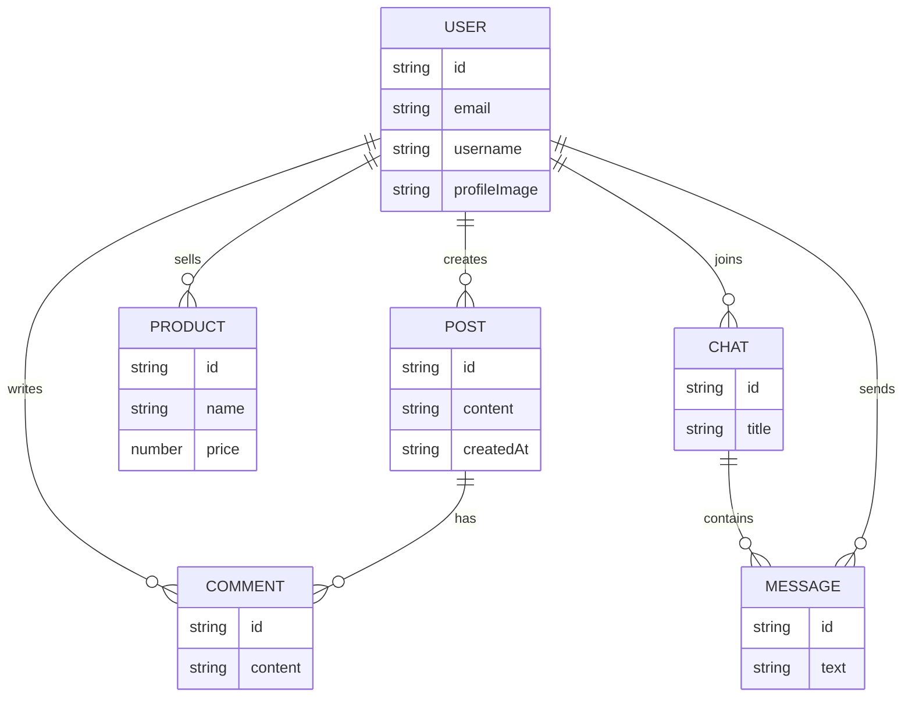
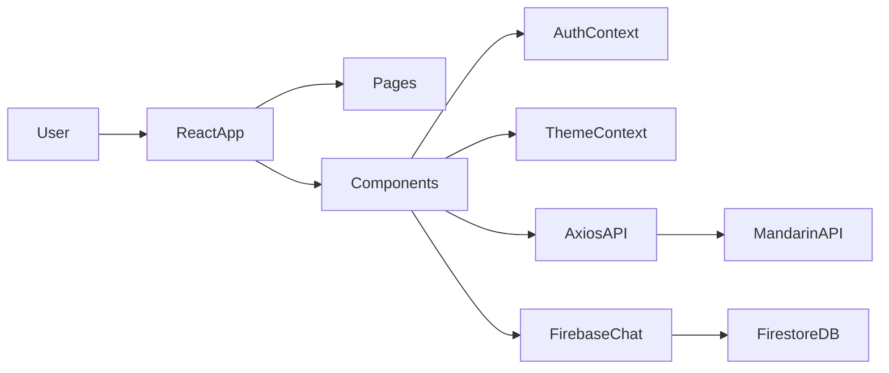

# 🍊 Mandarin Market (감귤마켓)

<p align="center">

</p>

<p align="center">


</p>

<p align="center">
SNS형 피드 + 중고거래 + 실시간 채팅을 결합한 <b>모바일 퍼스트 웹 애플리케이션</b>
</p>

---

# 프로젝트 소개

Mandarin Market은 **SNS 피드 + 중고거래 + 실시간 채팅** 기능을 제공하는 웹 애플리케이션입니다.

사용자는

- 게시글 작성
- 상품 등록
- 팔로우 및 사용자 검색
- Firebase 기반 실시간 채팅

을 사용할 수 있습니다.

---

# Team

<table>
<tr>

<td align="center">
<b>강민기</b><br/>
Frontend
</td>

<td align="center">
<b>박미소</b><br/>
Frontend
</td>

<td align="center">
<b>변슬기</b><br/>
Chat System
</td>

<td align="center">
<b>백동명</b><br/>
Chat / Post
</td>

<td align="center">
<b>손은애</b><br/>
Profile / Docs
</td>

</tr>
</table>

---

# 주요 기능

| 기능 | 설명 |
|---|---|
| 사용자 인증 | 회원가입 / 로그인 |
| 피드 | 게시글 CRUD, 좋아요, 댓글 |
| 상품 | 상품 등록 및 수정 |
| 검색 | 사용자 검색 |
| 팔로우 | 팔로우 / 언팔로우 |
| 채팅 | Firebase 실시간 채팅 |

---

# 주요 기능 (GIF)

### 로그인


### 게시글 작성


### 실시간 채팅


### 상품 등록


---

# Screenshots

| Splash | Login | Feed |
|---|---|---|
|  |  |  |

| Chat | Profile | Upload |
|---|---|---|
|  |  |  |

---

# ERD



---

# System Architecture



---

# Application Architecture

```
src
 ├── api
 │    ├ auth
 │    ├ user
 │    ├ post
 │    └ product
 │
 ├── components
 │
 ├── context
 │
 ├── firebase
 │
 ├── pages
 │
 ├── styles
 │
 └── utils
```

---

# 기술 스택

### Frontend

- React
- Vite
- React Router

### Styling

- styled-components

### Networking

- Axios

### Realtime

- Firebase Firestore

### API

- Weniv Mandarin API

---

# 개발 일정 (WBS)


---

# 실행 방법

### 설치

```
git clone https://github.com/Hallabong-Frontend/mandarin-market.git
cd mandarin-market
npm install
```

### 실행

```
npm run dev
```

---

# 브랜치 전략

```
main
 └ dev
     ├ feature/*
     └ fix/*
```

---

# 협업 프로세스

1. Issue 생성
2. feature 브랜치 생성
3. 개발
4. Pull Request
5. Code Review 후 merge

---

# 코드 품질 관리

```
npm run lint
npm run format
```

---

# Troubleshooting

### npm 실행 오류

```
npm : this system cannot run script npm.ps1
```

해결

```
Set-ExecutionPolicy RemoteSigned
```

---

# 개발하면서 느낀점

### 강민기
(작성 예정)

### 박미소
(작성 예정)

### 변슬기
(작성 예정)

### 백동명
(작성 예정)

### 손은애
(작성 예정)

---

# 추후 개발 사항

- 채팅 성능 개선
- 테스트 코드 도입
- CI/CD 구축
- 접근성 개선

---

<p align="center">

</p>
