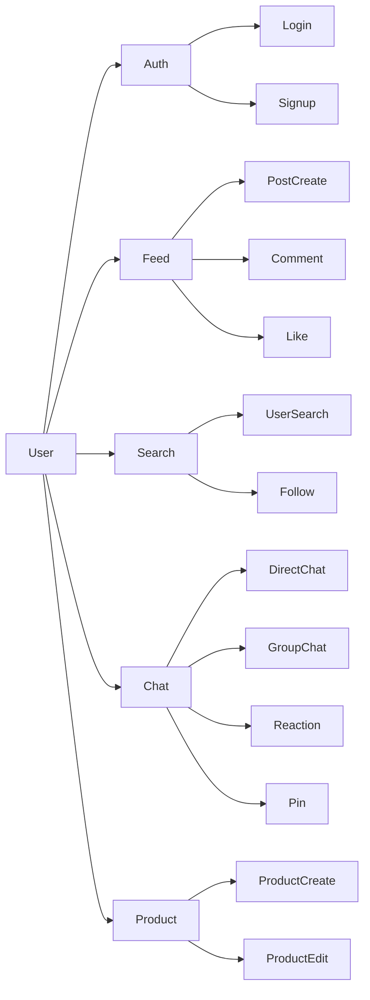
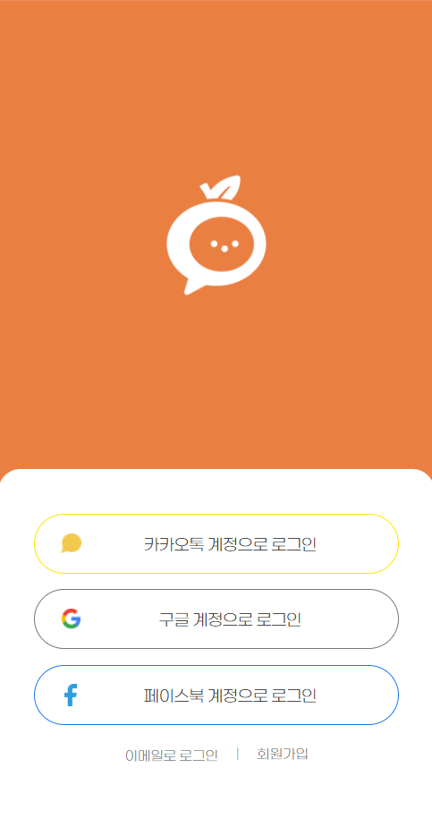
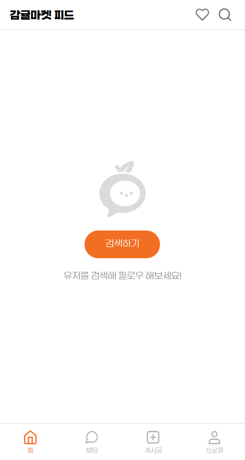
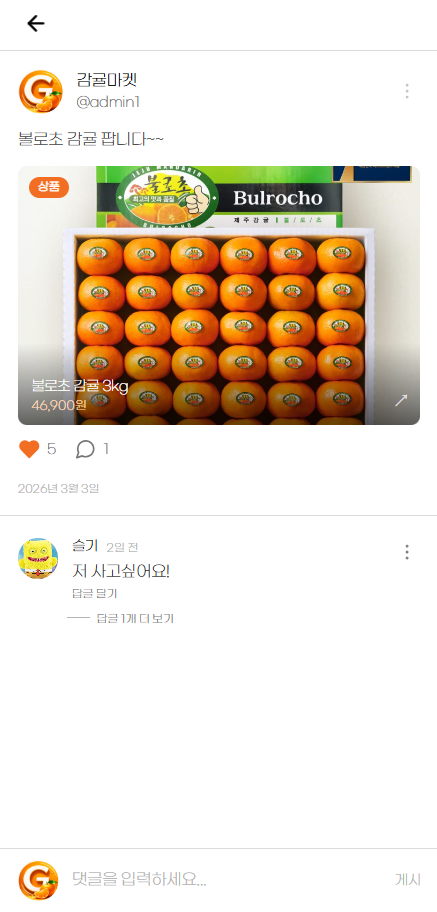
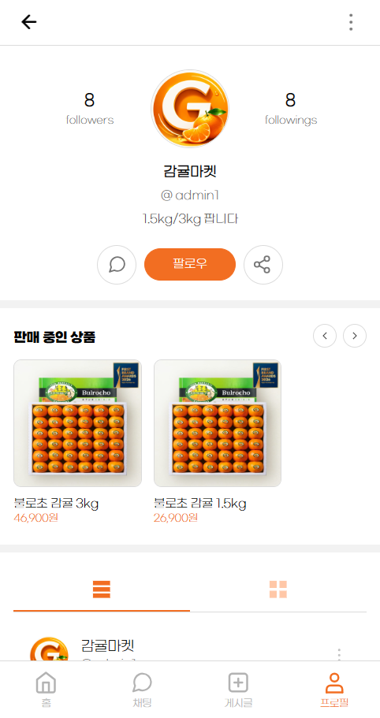
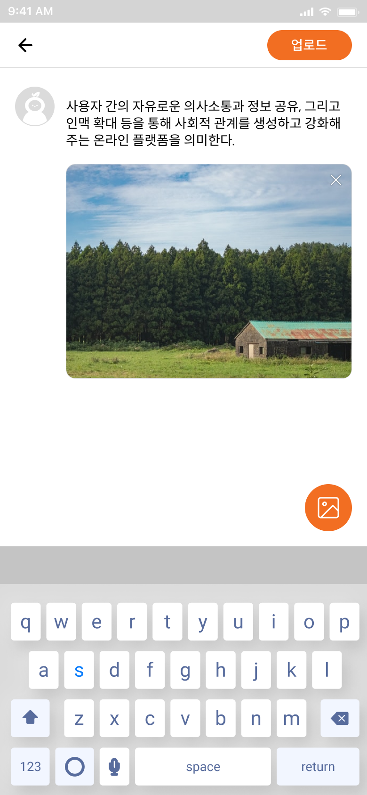
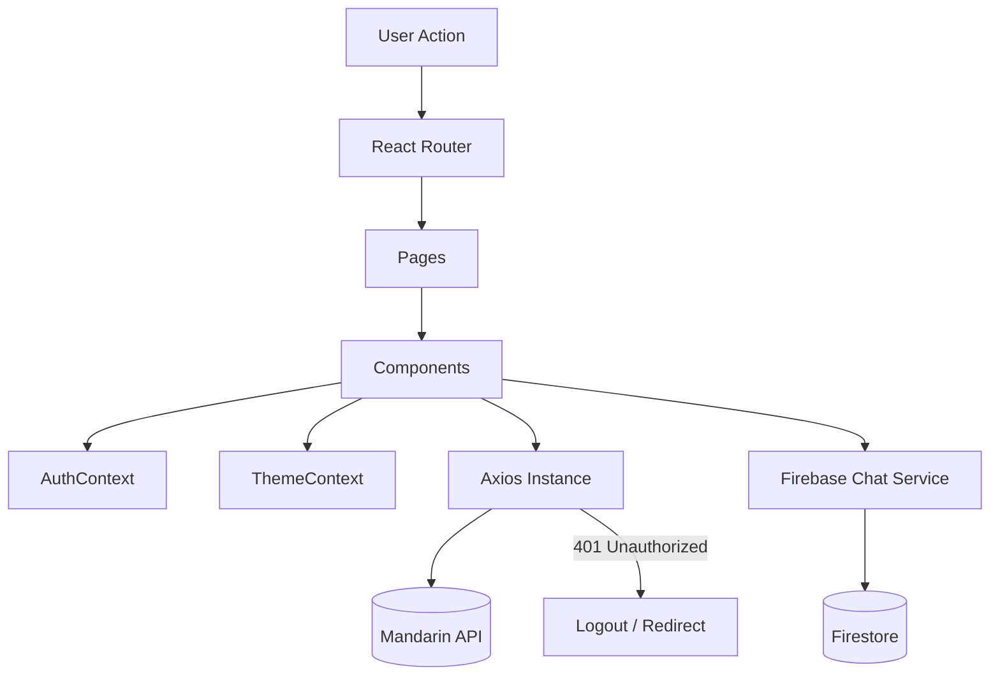
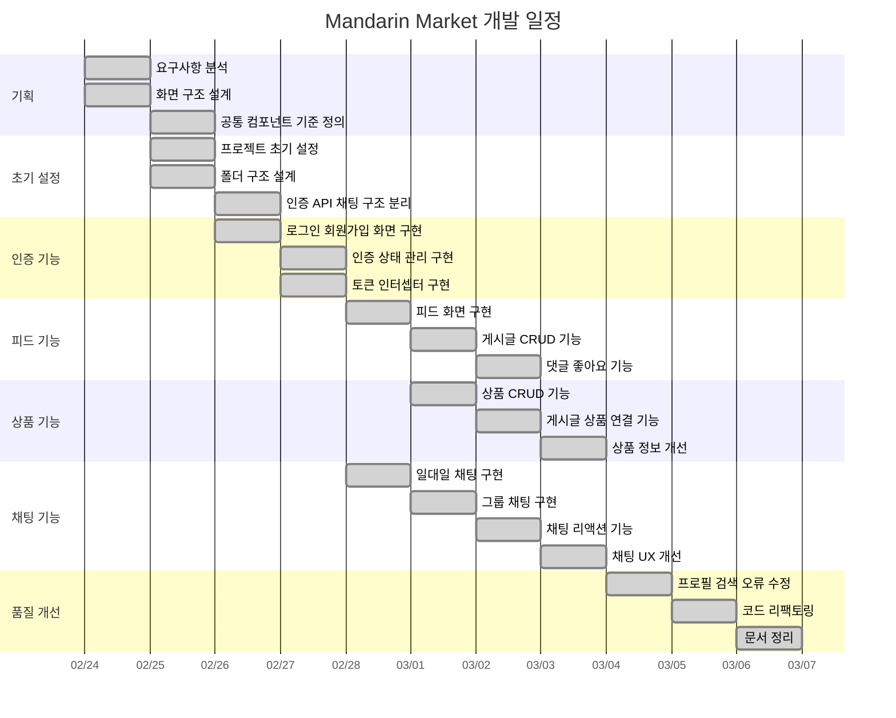

# Mandarin Market (감귤마켓)

<p align="center">

</p>

<p align="center">


SNS형 피드 + 중고거래 + 실시간 채팅을 결합한 **모바일 퍼스트 웹 앱**입니다.  
게시글/상품 CRUD, 팔로우/검색, 그리고 **Firebase Firestore 기반 채팅(1:1/그룹/리액션/핀/테마)**을 제공합니다.

> **Design**: Mobile-first / max-width 390px  
> **API Base**: `https://dev.wenivops.co.kr/services/mandarin`  
> **AI Proxy**: `https://dev.wenivops.co.kr/services/openai-api`

---

## 목차
- [프로젝트 목표](#프로젝트-목표)
- [배포](#배포)
- [테스트 계정](#테스트-계정)
- [기술 스택](#기술-스택)
- [팀원 역할 및 담당 업무](#팀원-역할-및-담당-업무)
- [핵심 기능](#핵심-기능)
- [주요 기능 GIF](#주요-기능-gif)
- [주요 화면](#주요-화면)
- [아키텍처](#아키텍처)
- [설계 중심 폴더 구조](#설계-중심-폴더-구조)
- [개발 일정 (WBS)](#개발-일정-wbs)
- [개발 일정 요약표](#개발-일정-요약표)
- [협업 프로세스](#협업-프로세스)
- [개발환경 및 실행](#개발환경-및-실행)
- [환경 변수](#환경-변수)
- [트러블슈팅](#트러블슈팅)
- [프로젝트 회고](#프로젝트-회고)
- [추후 개발 사항](#추후-개발-사항)

---

## 프로젝트 목표

- **커뮤니티(피드) + 거래(상품) + 소통(채팅)** 기능을 하나의 서비스 안에서 제공
- 협업에 적합한 **레이어 분리(UI / Context / API / Firebase)** 구조 설계
- 모바일 환경에서 자연스럽게 동작하는 **Mobile-first UI/UX** 구현
- 실시간 상호작용이 필요한 채팅 기능을 안정적으로 제공

---

## 배포

- **배포 URL**: (추가 예정)

---

## 테스트 계정

### 일반 사용자
- ID: `test_user_01`
- PW: `********`

### 판매 사용자
- ID: `test_seller_01`
- PW: `********`

---

## 기술 스택

| 분류 | 기술 | 선택 이유 |
|---|---|---|
| Frontend | React 19 | 컴포넌트 단위 UI 구조로 재사용성과 유지보수성이 높아 팀 프로젝트에 적합했습니다. |
| Build Tool | Vite | 개발 서버가 빠르고 설정이 간단해 초기 세팅 부담이 적었으며 짧은 프로젝트 기간에 생산성이 높았습니다. |
| Routing | React Router v7 | 페이지 수가 많은 서비스에서 라우팅 구조를 명확하게 관리할 수 있고 URL 기반 화면 전환이 자연스러웠습니다. |
| Styling | styled-components | 컴포넌트 단위 스타일 관리가 가능하고 props 기반 스타일 제어 및 테마 적용이 쉬워 UI 일관성을 유지하기 좋았습니다. |
| HTTP Client | Axios | 공통 인스턴스와 인터셉터를 통해 토큰 주입, 에러 처리, 401 대응을 일관되게 관리할 수 있습니다. |
| Realtime | Firebase Firestore | 채팅처럼 실시간성이 중요한 기능을 별도 서버 구축 없이 빠르게 구현할 수 있으며 구독 기반 데이터 흐름에 적합했습니다. |
| State Management | React Context API | 전역으로 공유해야 하는 인증 상태와 테마 상태 범위가 명확해 별도 상태관리 라이브러리 없이도 충분히 관리할 수 있었습니다. |
| Backend API | Weniv Mandarin API | 프로젝트 요구사항에 맞는 사용자, 게시글, 상품 API를 제공해 빠르게 서비스 기능을 구현할 수 있었습니다. |
| AI | Weniv OpenAI Proxy | 상품 설명 생성 기능을 구현하기 위해 OpenAI 기반 API를 프록시 형태로 활용했습니다. |

---

## 팀원 역할 및 담당 업무

> 프로젝트의 원활한 진행을 위해 기능 단위로 역할을 분담하여 개발을 진행했습니다.

### 강민기  
**Interaction & Modal**

**주요 구현 기능**
- 댓글 페이지 (`postDetail`) UI
- 공통 모달 UI (게시글 / 댓글)
- 댓글 삭제 및 신고 기능
- 작성 시간 표시 및 댓글 개수 카운트

**핵심 구현**
- **작성자 여부에 따른 모달 분기 처리**
  - 작성자 → 수정 / 삭제  
  - 타 사용자 → 신고

---

### 박미소  
**Feed & Navigation**

**주요 구현 기능**
- 메인 피드(Home) UI 구현
- 하단 탭 메뉴 (활성 상태 관리)
- 좋아요 버튼 토글 및 개수 카운트
- 전역 상태 관리 초기 구조 설계

**핵심 구현**
- **팔로우한 사용자 게시글 목록 렌더링**

---

### 백동명  
**Content Creation & AI**

**주요 구현 기능**
- 게시글 작성 페이지 (이미지 업로드)
- 상품 등록 페이지
- 다중 이미지 업로드 (최대 3장)

**핵심 구현**
- **AI 상품 설명 자동 생성 기능**
- 스트리밍 응답 처리
- 덮어쓰기 모달 구현

---

### 변슬기  
**Auth & Onboarding**

**주요 구현 기능**
- Splash 화면 구현
- 로그인 (메인 / 이메일)
- 회원가입 및 프로필 설정
- SPA 라우팅 초기 세팅 보조

**핵심 구현**
- 이메일, 비밀번호 등 **실시간 유효성 검사 로직 구현**

---

### 손은애  
**Profile & User Management**

**주요 구현 기능**
- 사용자 프로필 페이지 (내 프로필 / 타인 프로필 분기)
- 팔로워 / 팔로잉 목록 페이지
- 프로필 수정 페이지
- 팔로우 / 언팔로우 기능 구현

**핵심 구현**
- **사용자 데이터에 따른 게시글 / 상품 조건부 렌더링**

---

### 전체
**Search & Chat UI**

**주요 구현 기능**
- 채팅 목록 UI
- 채팅방 UI
- 검색 페이지 UI

**핵심 구현**
- 사용자 이름 / 계정 검색 기능
- **검색어 하이라이트 기능 구현**

---
  
## 핵심 기능

### 기능 구조 다이어그램



### 1. 인증 / 유저
- 회원가입 / 로그인
- AuthContext 기반 전역 인증 상태 관리
- 토큰 저장 및 사용자 정보 갱신

### 2. 피드 / 게시글
- 게시글 CRUD
- 좋아요 / 댓글 / 대댓글
- 게시글과 상품 연결

### 3. 상품
- 상품 CRUD
- 상품 설명 생성 보조 기능

### 4. 검색 / 팔로우
- 사용자 검색
- 팔로우 / 언팔로우
- 팔로워 / 팔로잉 리스트

### 5. 실시간 채팅
- 1:1 채팅
- 그룹 채팅
- 메시지 전송 / 수정 / 삭제
- 리액션 기능
- 채팅 핀 / 테마 설정

---

## 주요 기능 GIF

| 로그인 | 채팅 |
|------|------|
|  |  |

| 게시글 | 상품 |
|------|------|
|  |  |

---

## 주요 화면

| Login | Feed | Post |
|---|---|---|
|  |  |  |

| Chat Room | Profile | Upload |
|---|---|---|
|  |  |  |

---

## 아키텍처

### 1) Layered Architecture

```text
UI (Pages / Components)
 ├─ Context Layer
 │   ├─ AuthContext
 │   └─ ThemeContext
 ├─ API Layer
 │   ├─ Axios Instance
 │   └─ Domain API Modules
 └─ Firebase Layer
     └─ Chat Service
```

### 2) Runtime Flow



### 3) 핵심 설계 포인트
- **UI / API / Firebase 역할을 분리**해 기능별 책임을 명확하게 나눴습니다.
- **인증 흐름은 Context + Axios Interceptor** 조합으로 일관되게 처리했습니다.
- **채팅 기능은 Firestore 기반 구독 구조**로 구현해 실시간 동기화를 보장했습니다.

---

## 설계 중심 폴더 구조

```text
src/
 ├─ pages/        # 라우트 단위 화면
 ├─ components/   # 공통 UI 및 도메인 컴포넌트
 ├─ context/      # 인증, 테마 등 전역 상태
 ├─ api/          # REST API 요청 모듈
 ├─ firebase/     # 실시간 채팅 서비스 로직
 ├─ hooks/        # 재사용 가능한 커스텀 훅
 ├─ utils/        # 포맷, 검증, 공통 함수
 ├─ styles/       # 전역 스타일, theme
 └─ constants/    # URL, 상수 값 관리
```

### 구조 설계 의도
- **pages**: 사용자 흐름 중심으로 화면을 나누기 위해 분리
- **components**: 재사용 가능한 UI 단위 모음
- **api / firebase**: 외부 데이터 소스별 역할 분리
- **context**: 여러 컴포넌트에서 공유하는 상태 집중 관리
- **utils / hooks**: 중복 로직 제거와 재사용성 확보

---

## 개발 일정 (WBS)



---

## 개발 일정 요약표

| 날짜 | 주요 작업 |
|---|---|
| 02/24 | 요구사항 분석, 화면 구조 설계 |
| 02/25 | 프로젝트 초기 세팅, 폴더 구조 설계 |
| 02/26 | 인증 화면 구현, 전역 상태 구조 정리 |
| 02/27 | 토큰 처리, Axios 인터셉터 적용 |
| 02/28 | 피드 UI 구현, 1:1 채팅 기능 구현 |
| 03/01 | 게시글/상품 기능 구현, 그룹 채팅 기능 추가 |
| 03/02 | 댓글/좋아요, 채팅 리액션/핀/테마 기능 구현 |
| 03/03 | 채팅 UX 개선 및 버그 수정 |
| 03/04 | 프로필/검색/예외 처리 보완 |
| 03/05 | 리팩토링 및 구조 정리 |
| 03/06 | 문서화 및 README 정리 |

---

## 협업 프로세스

### 1. Issue 기반 작업 분리
- 작업은 가능한 한 **작은 단위의 이슈**로 분리했습니다.
- 한 이슈에는 1~2개의 기능만 포함해 작업 범위를 명확하게 유지했습니다.

### 2. 브랜치 분기 후 기능 개발
- `dev` 브랜치에서 작업 브랜치를 분기했습니다.
- 기능 개발과 버그 수정 브랜치를 분리해 충돌을 줄였습니다.

### 3. PR 기반 코드 리뷰
- 모든 작업은 PR을 통해 병합했습니다.
- PR에는 작업 목적, 변경 내용, 확인 포인트를 함께 남겼습니다.
- UI 변경 사항은 가능하면 스크린샷과 함께 공유했습니다.

### 4. 공통 규칙 점검 후 병합
- merge 전 lint / format / 동작 확인을 거쳤습니다.
- 공통 컴포넌트나 전역 상태에 영향을 주는 변경은 우선 리뷰했습니다.

### 협업 흐름

```text
Issue 생성
  ↓
작업 브랜치 분기
  ↓
기능 개발 / 자체 테스트
  ↓
Pull Request 작성
  ↓
코드 리뷰 및 피드백 반영
  ↓
dev 브랜치 병합
```

---

## 개발환경 및 실행

### 요구사항
- Node.js (권장: LTS)

### 설치 및 실행
```bash
git clone https://github.com/Hallabong-Frontend/mandarin-market.git
cd mandarin-market
npm install
npm run dev
```

### 코드 품질 스크립트
```bash
npm run lint
npm run format
npm run format:check
```

---

## 환경 변수

Firebase 기능 사용을 위해 `.env` 파일이 필요합니다.

```bash
VITE_FIREBASE_API_KEY=
VITE_FIREBASE_AUTH_DOMAIN=
VITE_FIREBASE_PROJECT_ID=
VITE_FIREBASE_STORAGE_BUCKET=
VITE_FIREBASE_MESSAGING_SENDER_ID=
VITE_FIREBASE_APP_ID=
VITE_FIREBASE_MEASUREMENT_ID=
```

---

## 트러블슈팅

### 1. 인증 토큰 만료 시 반복적인 401 에러 발생

**문제**  
로그인 이후 일부 API 요청에서 토큰 만료로 401 에러가 발생했고, 페이지마다 중복 대응 로직이 필요했습니다.

**해결**  
Axios 인터셉터에서 토큰 주입과 401 에러 처리를 공통화해, 중복 코드를 줄이고 인증 흐름을 일관되게 관리했습니다.

```javascript
import axios from 'axios';

const api = axios.create({
  baseURL: BASE_URL,
});

api.interceptors.request.use((config) => {
  const token = localStorage.getItem('token');

  if (token) {
    config.headers.Authorization = `Bearer ${token}`;
  }

  return config;
});

api.interceptors.response.use(
  (response) => response,
  (error) => {
    if (error.response?.status === 401) {
      localStorage.removeItem('token');
      localStorage.removeItem('accountname');
      window.location.href = '/login';
    }

    return Promise.reject(error);
  }
);

export default api;
```

**결과**
- 토큰 처리 로직을 한 곳에서 관리
- 인증 관련 중복 코드 감소
- 만료 토큰 상태에서 사용자 경험 일관화

---

### 2. 채팅방 입장/이동 시 스크롤과 구독이 불안정했던 문제

**문제**  
채팅방 이동 시 중복 구독이 생기거나, 새 메시지가 들어왔을 때 스크롤 위치가 의도와 다르게 동작하는 문제가 있었습니다.

**해결**  
`useEffect` 내부에서 구독 해제(clean-up)를 명확히 하고, 조건부 자동 스크롤을 적용해 UX를 안정화했습니다.

```javascript
useEffect(() => {
  if (!chatId) return;

  const unsubscribe = subscribeMessages(chatId, (nextMessages) => {
    setMessages(nextMessages);

    const isNearBottom =
      messageListRef.current &&
      messageListRef.current.scrollHeight -
        messageListRef.current.scrollTop -
        messageListRef.current.clientHeight < 80;

    if (isNearBottom) {
      requestAnimationFrame(() => {
        bottomRef.current?.scrollIntoView({ behavior: 'smooth' });
      });
    }
  });

  return () => unsubscribe();
}, [chatId]);
```

**결과**
- 채팅방 이동 시 중복 listener 문제 완화
- 불필요한 강제 스크롤 감소
- 새 메시지 수신 경험 개선

---

## 프로젝트 회고

### 강민기
> (작성 예정)

### 박미소
> (작성 예정)

### 변슬기
> (작성 예정)

### 백동명
> (작성 예정)

### 손은애
> 프로필 및 사용자 관리 기능을 구현하면서, 단순히 화면을 만드는 것을 넘어 데이터 변화에 따라 UI가 자연스럽게 반응하도록 설계하는 경험을 할 수 있었습니다. 팔로우/언팔로우, 프로필 수정, 조건부 렌더링처럼 상태 변화가 많은 기능을 다루며 사용자 흐름을 더 세심하게 고민하게 되었고, 협업 과정에서는 공통 구조와 역할 분리의 중요성을 다시 느꼈습니다.

---

## 추후 개발 사항

- [ ] 채팅 성능 개선
- [ ] 테스트 코드 도입
- [ ] CI 자동화

---
