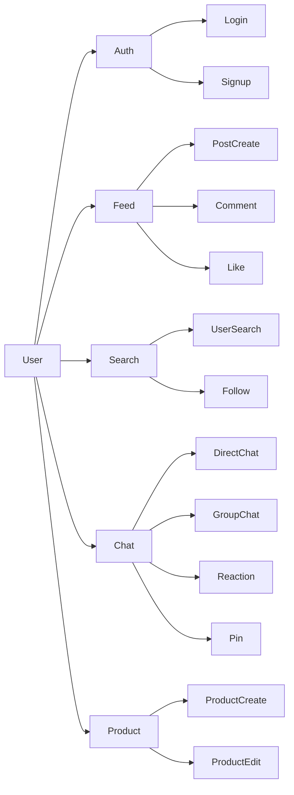
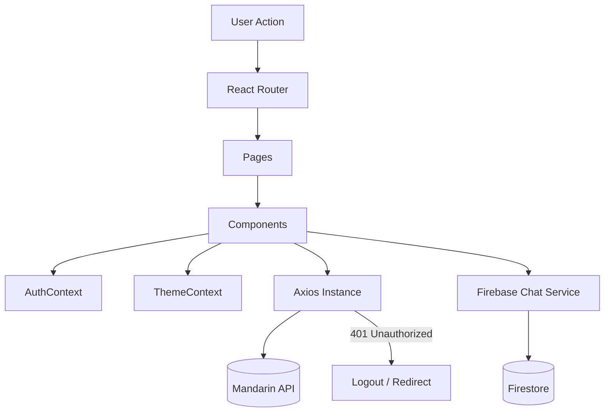
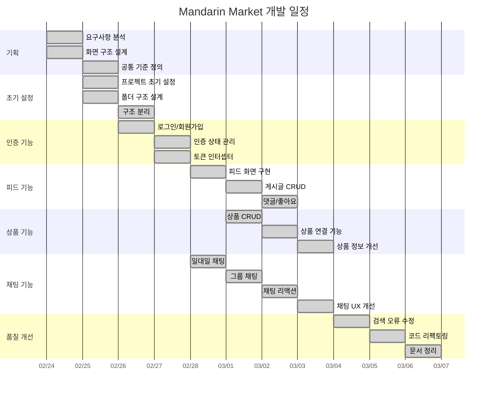

# Mandarin Market (감귤마켓)

<p align="center">

</p>

<p align="center">


SNS형 피드 + 중고거래 + 실시간 채팅을 결합한 **모바일 퍼스트 웹 앱**입니다.  
게시글/상품 CRUD, 팔로우/검색, 그리고 **Firebase Firestore 기반 채팅(1:1/그룹/리액션/핀/테마)**을 제공합니다.

> **Design**: Mobile-first / max-width 390px  
> **API Base**: `https://dev.wenivops.co.kr/services/mandarin`  
> **AI Proxy**: `https://dev.wenivops.co.kr/services/openai-api`

---

## 목차

- [프로젝트 목표](#프로젝트-목표)
- [배포](#배포)
- [테스트 계정](#테스트-계정)
- [기술 스택](#기술-스택)
- [팀원 역할 및 담당 업무](#팀원-역할-및-담당-업무)
- [핵심 기능](#핵심-기능)
- [주요 기능 GIF](#주요-기능-gif)
- [아키텍처](#아키텍처)
- [설계 중심 폴더 구조](#설계-중심-폴더-구조)
- [개발 일정 (WBS)](#개발-일정-wbs)
- [협업 프로세스](#협업-프로세스)
- [회의록](#5-회의록)
- [개발 과정의 AI 활용](#개발-과정의-ai-활용)
- [개발환경 및 실행](#개발환경-및-실행)
- [환경 변수](#환경-변수)
- [Quality Assurance (QA)](#quality-assurance-qa)
- [트러블슈팅](#트러블슈팅)
- [프로젝트 회고](#프로젝트-회고)
- [추후 개발 사항](#추후-개발-사항)

---

## 프로젝트 목표

- **커뮤니티(피드) + 거래(상품) + 소통(채팅)** 기능을 하나의 서비스 안에서 제공
- 협업에 적합한 **레이어 분리(UI / Context / API / Firebase)** 구조 설계
- 모바일 환경에서 자연스럽게 동작하는 **Mobile-first UI/UX** 구현
- 실시간 상호작용이 필요한 채팅 기능을 안정적으로 제공

---

## 배포

- **배포 URL**: https://mandarin-market-project.netlify.app/

---

## 테스트 계정

- ID: `seller@mandarin.com`
- PW: `weniv1234`
- 사용자 이름: 만다린

---

## 기술 스택

| 분류             | 기술               | 선택 이유                                                                                                               |
| ---------------- | ------------------ | ----------------------------------------------------------------------------------------------------------------------- |
| Frontend         | React 19           | 컴포넌트 단위 UI 구조로 재사용성과 유지보수성이 높아 팀 프로젝트에 적합했습니다.                                        |
| Build Tool       | Vite               | 개발 서버가 빠르고 설정이 간단해 초기 세팅 부담이 적었으며 짧은 프로젝트 기간에 생산성이 높았습니다.                    |
| Routing          | React Router v7    | 페이지 수가 많은 서비스에서 라우팅 구조를 명확하게 관리할 수 있고 URL 기반 화면 전환이 자연스러웠습니다.                |
| Styling          | styled-components  | 컴포넌트 단위 스타일 관리가 가능하고 props 기반 스타일 제어 및 테마 적용이 쉬워 UI 일관성을 유지하기 좋았습니다.        |
| HTTP Client      | Axios              | 공통 인스턴스와 인터셉터를 통해 토큰 주입, 에러 처리, 401 대응을 일관되게 관리할 수 있습니다.                           |
| Realtime         | Firebase Firestore | 채팅처럼 실시간성이 중요한 기능을 별도 서버 구축 없이 빠르게 구현할 수 있으며 구독 기반 데이터 흐름에 적합했습니다.     |
| State Management | React Context API  | 전역으로 공유해야 하는 인증 상태와 테마 상태 범위가 명확해 별도 상태관리 라이브러리 없이도 충분히 관리할 수 있었습니다. |
| Backend API      | Weniv Mandarin API | 프로젝트 요구사항에 맞는 사용자, 게시글, 상품 API를 제공해 빠르게 서비스 기능을 구현할 수 있었습니다.                   |
| AI               | Weniv OpenAI Proxy | 상품 설명 생성 기능을 구현하기 위해 OpenAI 기반 API를 프록시 형태로 활용했습니다.                                       |

---

## 팀원 역할 및 담당 업무

> 프로젝트의 원활한 진행을 위해 기능 단위로 역할을 분담하여 개발을 진행했습니다.

### 강민기

**Interaction & Modal**

**주요 구현 기능**

**Post & Comment**

- 댓글 페이지 (`postDetail`) UI
- 공통 모달 UI (게시글 / 댓글)
- 댓글 삭제 및 신고 기능
- 작성 시간 표시 및 댓글 개수 카운트
- 댓글 게시 및 삭제 후 개수 실시간 변경
- 게시글 날짜 생성 및 줄바꿈 적용
- 게시글 사진 클릭 시 이동

**Chat**

- 채팅방 검색 기능
- 그룹채팅 및 초대하기 기능

**Common / Refactoring**

- 헤더 더보기 기능 및 헤더/게시글 스타일
- svg 하드 코딩 제거 및 styled-components 처리
- 아바타 및 EmptyState 컴포넌트화

**핵심 구현**

- **작성자 여부에 따른 모달 분기 처리(수정/삭제/신고)를 구현하고, 복잡한 Profile.jsx를 4개의 핵심 컴포넌트로 분리해 유지보수성을 높였습니다.**

---

### 박미소

**주요 구현 기능**

**Feed & Navigation**

- 메인 피드(Home) UI 구현
- 하단 탭 메뉴 (활성 상태 관리)
- 좋아요 버튼 토글 및 개수 카운트
- 좋아요 하트 아이콘 활성/비활성 색상 처리
- 전역 상태 관리 초기 구조 설계

**Post Detail**

- 대댓글 기능 (계층 구조)
- 댓글 고정 기능 (작성자 권한 기반)
- 이모지 리액션 (토글 방식)
- 댓글/대댓글 작성자 권한 분리

**핵심 구현**

**Firestore 컬렉션 구조 설계를 기반으로 대댓글 계층화, 작성자 권한 기반 댓글 고정/해제, 이모지 리액션 실시간 토글을 구현했습니다**

---

### 백동명

**팀 리더 / Content Creation & Chat**

**주요 구현 기능**

**Project Setup**

- 프로젝트 초기 설정 및 환경 구성 (Prettier, API URL)

**Post & Product**

- 게시글 작성 페이지 (다중 이미지 업로드, 삭제 모달, 반응형 textarea)
- 상품 등록 페이지 (AI 설명 자동 생성 연동, SVG 아이콘)
- 게시글에 상품 추가 및 표시 기능

**Chat**

- Firebase Firestore 실시간 채팅 연동
- 채팅 unread dot 표시 및 별명 설정 기능

**Common / Refactoring**

- Header 스크롤 자동 숨김/표시 및 컴포넌트 리팩토링
- `FullPagePanel` 공통 컴포넌트 추출
- 잘못된 URL 접근 시 `/not-found` 리다이렉트 처리

**핵심 구현**

- **Firebase Firestore 구독 구조를 직접 설계해 실시간 채팅을 구현하고, AI 상품 설명 자동 생성 기능을 구분자 기반 저장 로직으로 연동했습니다.**

---

### 변슬기

**주요 구현 기능**

**Auth & Onboarding**

- Splash 화면 구현
- 로그인 (메인 / 이메일)
- 회원가입 및 프로필 설정
- SPA 라우팅 초기 세팅 보조
- 공통 UI 컴포넌트(Input, Button) 분리

**ChatList**

- 터치/마우스 기반 양방향 스와이프 액션 구현
- 채팅방 목록 렌더링 및 모바일 뷰 테두리 노출 버그 최적화
- 채팅방 나가기 클릭 시 리스트 및 데이터 완전 삭제 동기화
- 타임스탬프 상대적 시간 포맷팅

**ChatRoom**

- 단체 채팅방 인원 변동(초대/나가기) 시스템 메시지 알림 처리
- 메시지 컨텍스트 메뉴 제어
- 텍스트 길이에 따른 채팅 입력창 자동 줄바꿈 적용 및 상대방 프로필 클릭 라우팅
- 동적 스크롤 제어

**핵심 구현**

- **이메일, 비밀번호 등 사용자 입력 데이터의 실시간 유효성 검사 로직을 구현하였고, 대규모 채팅 데이터 처리를 위한 렌더링 성능 최적화 및 보안을 강화하였습니다.**

---

### 손은애

**주요 구현 기능**

**Profile & User Management**

- 프로필 페이지 구현 (내 프로필 / 타인 프로필 분기)
- 팔로워 / 팔로잉 목록 페이지
- 프로필 수정 및 팔로우 / 언팔로우 기능
- 사용자 데이터 기반 게시글 / 상품 조건부 렌더링
- 설정 및 개인정보 페이지 구현

**Chat**

- 채팅방 이름 수정 및 메시지 검색 기능
- 채팅 날짜 구분 및 메시지 시간 표시 로직
- 채팅방 구성원 수 표시
- 채팅 최하단 이동 버튼 구현

**Feed / UI**

- 게시글 업로드 후 상세 페이지 이동
- 게시물 카드 → 상세 페이지 연결
- 게시글 다중 이미지 표시
- 공유 버튼 기능 추가

**핵심 구현**

- **사용자 데이터 상태에 따라 게시글, 상품, 팔로우 UI가 동적으로 반영되도록 조건부 렌더링 구조를 구현하고, 채팅 메시지 날짜·시간 표시 로직과 메시지 검색 기능을 개선해 채팅 사용 경험을 향상시켰습니다.**

---

## 핵심 기능

### 기능 구조 다이어그램



### 1. 인증 / 유저

- 회원가입 / 로그인
- AuthContext 기반 전역 인증 상태 관리
- 토큰 저장 및 사용자 정보 갱신

### 2. 피드 / 게시글

- 게시글 CRUD
- 좋아요 / 댓글 / 대댓글
- 게시글과 상품 연결

### 3. 상품

- 상품 CRUD
- 상품 설명 생성 보조 기능

### 4. 검색 / 팔로우

- 사용자 검색
- 팔로우 / 언팔로우
- 팔로워 / 팔로잉 리스트

### 5. 실시간 채팅

- 1:1 채팅
- 그룹 채팅
- 메시지 전송 / 수정 / 삭제
- 리액션 기능
- 채팅 핀 / 테마 설정

---

## 주요 기능 GIF

| 스플래시                                                                                     | 회원가입                                                                                     |
| -------------------------------------------------------------------------------------------- | -------------------------------------------------------------------------------------------- |
|  |  |

| 프로필설정                                                                                     | 검색                                                                                     |
| ---------------------------------------------------------------------------------------------- | ---------------------------------------------------------------------------------------- |
|  |  |

| 피드                                                                                     | 게시글상세                                                                                     |
| ---------------------------------------------------------------------------------------- | ---------------------------------------------------------------------------------------------- |
|  |  |

| 채팅방1                                                                                     | 채팅방2                                                                                     |
| ------------------------------------------------------------------------------------------- | ------------------------------------------------------------------------------------------- |
|  |  |

| 채팅방3                                                                                     | 채팅방4                                                                                     |
| ------------------------------------------------------------------------------------------- | ------------------------------------------------------------------------------------------- |
|  |  |

| 게시글생성                                                                                     | 알림                                                                                     |
| ---------------------------------------------------------------------------------------------- | ---------------------------------------------------------------------------------------- |
|  |  |

| 프로필공유                                                                                     | 팔로우                                                                                     |
| ---------------------------------------------------------------------------------------------- | ------------------------------------------------------------------------------------------ |
|  |  |

| 설정 및 개인정보                                                                                     | 프로필수정                                                                                     |
| ---------------------------------------------------------------------------------------------------- | ---------------------------------------------------------------------------------------------- |
|  |  |

| 그룹채팅                                                                                     | 그룹채팅상세                                                                                     |
| -------------------------------------------------------------------------------------------- | ------------------------------------------------------------------------------------------------ |
|  |  |

| 상품등록                                                                                     | 상품인용게시물                                                                                     |
| -------------------------------------------------------------------------------------------- | -------------------------------------------------------------------------------------------------- |
|  |  |

---

## 아키텍처

### 1) Layered Architecture

```text
UI (Pages / Components)
 ├─ Context Layer
 │   ├─ AuthContext
 │   └─ ThemeContext
 ├─ API Layer
 │   ├─ Axios Instance
 │   └─ Domain API Modules
 └─ Firebase Layer
     └─ Chat Service
```

### 2) Runtime Flow



### 3) 핵심 설계 포인트

- **UI / API / Firebase 역할을 분리**해 기능별 책임을 명확하게 나눴습니다.
- **인증 흐름은 Context + Axios Interceptor** 조합으로 일관되게 처리했습니다.
- **채팅 기능은 Firestore 기반 구독 구조**로 구현해 실시간 동기화를 보장했습니다.

---

## 설계 중심 폴더 구조

```text
src/
 ├─ pages/        # 라우트 단위 화면
 ├─ components/   # 공통 UI 및 도메인 컴포넌트
 ├─ context/      # 인증, 테마 등 전역 상태
 ├─ api/          # REST API 요청 모듈
 ├─ firebase/     # 실시간 채팅 서비스 로직
 ├─ hooks/        # 재사용 가능한 커스텀 훅
 ├─ utils/        # 포맷, 검증, 공통 함수
 ├─ styles/       # 전역 스타일, theme
 └─ constants/    # URL, 상수 값 관리
```

### 구조 설계 의도

- **pages**: 사용자 흐름 중심으로 화면을 나누기 위해 분리
- **components**: 재사용 가능한 UI 단위 모음
- **api / firebase**: 외부 데이터 소스별 역할 분리
- **context**: 여러 컴포넌트에서 공유하는 상태 집중 관리
- **utils / hooks**: 중복 로직 제거와 재사용성 확보

---

## 개발 일정 (WBS)


---

## 협업 프로세스

### 1. Issue 기반 작업 분리

- 작업은 가능한 한 **작은 단위의 이슈**로 분리했습니다.
- 한 이슈에는 1~2개의 기능만 포함해 작업 범위를 명확하게 유지했습니다.

### 2. 브랜치 분기 후 기능 개발

- `dev` 브랜치에서 작업 브랜치를 분기했습니다.
- 기능 개발과 버그 수정 브랜치를 분리해 충돌을 줄였습니다.

### 3. PR 기반 코드 리뷰

- 모든 작업은 PR을 통해 병합했습니다.
- PR에는 작업 목적, 변경 내용, 확인 포인트를 함께 남겼습니다.
- UI 변경 사항은 가능하면 스크린샷과 함께 공유했습니다.

### 4. 공통 규칙 점검 후 병합

- merge 전 lint / format / 동작 확인을 거쳤습니다.
- 공통 컴포넌트나 전역 상태에 영향을 주는 변경은 우선 리뷰했습니다.

### 협업 흐름

```text
Issue 생성
  ↓
작업 브랜치 분기
  ↓
기능 개발 / 자체 테스트
  ↓
Pull Request 작성
  ↓
코드 리뷰 및 피드백 반영
  ↓
dev 브랜치 병합
```

### 5. 회의록

팀 회의 내용은 아래 링크에서 확인할 수 있습니다.

- **회의록 전체 목록**: [GitHub Discussions](https://github.com/orgs/Hallabong-Frontend/discussions)

#### 회의록 예시 — [02-28 진행 상황 공유](https://github.com/orgs/Hallabong-Frontend/discussions/91)

**일시**: 2026-02-28
**참석자**: 강민기, 박미소, 백동명, 변슬기, 손은애

**진행 상황 및 결정 사항**

| 담당자 &nbsp;&nbsp;&nbsp;&nbsp;&nbsp;&nbsp;&nbsp;&nbsp; | 어제 한 일 (02-27)                                                                                                                                                         | 오늘 할 일 (02-28)                                                                                         |
| :------------------------------------------------------ | :------------------------------------------------------------------------------------------------------------------------------------------------------------------------- | :--------------------------------------------------------------------------------------------------------- |
| 변슬기                                                  | 회원가입 후 메인 피드로 진입하도록 수정 · 채팅방 나가기 기능을 삭제→나가기로 수정 · 채팅 우클릭 메뉴 분기(내 채팅: 수정/삭제, 타인 채팅: 신고/복사) · 붙여넣기 말풍선 추가 | 채팅방 프로필 사진 클릭 시 해당 프로필로 이동 · 채팅방 날짜 구분선 추가                                    |
| 박미소                                                  | 하트 색상 변경 · 홈 화면 정렬 크기 수정                                                                                                                                    | 404 페이지 제작                                                                                            |
| 손은애                                                  | 채팅 날짜 표시 · 같은 시간 메시지는 마지막 메시지에만 시간 표시 · 다크모드 · 설정 및 개인정보 구현                                                                         | 판매 중인 상품 화살표 변경 · 중복 상수 파일 분리                                                           |
| 강민기                                                  | 공통 Avatar 컴포넌트 분리 및 적용 · EmptyState 컴포넌트로 중복 요소 관리                                                                                                   | Divider 컴포넌트화 · 댓글 수정 기능 · Profile.jsx 5개 파일로 분할 · 피드 이미지 클릭 시 해당 게시글로 이동 |
| 백동명                                                  | 헤더 상단 고정 수정                                                                                                                                                        | 헤더 알림 버튼 추가 · 채팅방 헤더 고정                                                                     |

---

## 개발 과정의 AI 활용

본 프로젝트는 개발 도구로 **Claude Code (claude-sonnet-4-6)** 를 활용했습니다.
AI를 단순 코드 생성 도구가 아닌, 팀의 컨벤션을 인지하는 **협업 보조자**로 운영했습니다.

### 컨텍스트 문서화 (CLAUDE.md)

AI가 일관된 코드를 생성할 수 있도록 `CLAUDE.md` 파일에 프로젝트 구조를 명시했습니다.

- 폴더 구조, API 레이어 설계, 인증 흐름
- 스타일 테마 사용 방법 (`theme.colors.primary` 등)
- 공통 컴포넌트 목록과 사용 패턴
- 커밋 컨벤션 및 협업 규칙

이를 통해 AI가 기존 코드 스타일에서 벗어난 코드를 제안하는 상황을 줄였습니다.

### 주요 활용 영역

| 영역            | 내용                                                                                                            |
| --------------- | --------------------------------------------------------------------------------------------------------------- |
| 대규모 리팩토링 | `Profile.jsx` (650줄 → 100줄): ProfileInfo, ProfileProductList, ProfilePostSection, ProfileSettingsModal로 분리 |
| 대규모 리팩토링 | `ChatRoom.jsx` (909줄 → 377줄): ChatMessageItem, ChatInputBar, ChatContextMenu, chatFormat.js로 분리            |
| 대규모 리팩토링 | `ChatList.jsx` (505줄 → 245줄): ChatListItem, useChatSwipe, chatFormat.js로 분리                                |
| 버그 수정       | 이미지 `data:` URL 프리뷰 깨짐 문제, 에러 메시지 누락 등                                                        |
| 반복 코드 생성  | API 도메인 모듈 (`post.js`, `comment.js`, `product.js`) 초기 구조 작성                                          |
| 문서 작성       | README 구조화, CLAUDE.md 작성                                                                                   |

### 협업 원칙

1. **AI 초안 → 팀원 검토 → 병합**: AI가 생성한 코드는 반드시 직접 검토 후 PR을 통해 병합했습니다.
2. **반복 작업은 AI, 판단은 사람**: CRUD 패턴·리팩토링처럼 방향이 명확한 작업은 AI에게, 아키텍처 결정·UX 판단은 팀에서 직접 결정했습니다.
3. **컨텍스트 우선**: AI에게 요청하기 전에 `CLAUDE.md`를 최신 상태로 유지해 불필요한 수정 횟수를 줄였습니다.

---

## 개발환경 및 실행

### 요구사항

- Node.js (권장: LTS)

### 설치 및 실행

```bash
git clone https://github.com/Hallabong-Frontend/mandarin-market.git
cd mandarin-market
npm install
npm run dev
```

### 코드 품질 스크립트

```bash
npm run lint
npm run format
npm run format:check
```

---

## 환경 변수

Firebase 기능 사용을 위해 `.env` 파일이 필요합니다.

```bash
VITE_FIREBASE_API_KEY=
VITE_FIREBASE_AUTH_DOMAIN=
VITE_FIREBASE_PROJECT_ID=
VITE_FIREBASE_STORAGE_BUCKET=
VITE_FIREBASE_MESSAGING_SENDER_ID=
VITE_FIREBASE_APP_ID=
VITE_FIREBASE_MEASUREMENT_ID=
```

---

## Quality Assurance (QA)

단순한 기능 구현에 그치지 않고, 체계적인 자체 QA 테스트를 통해 엣지 케이스(Edge Case)와 UI/UX 결함을 찾아내어 프로젝트의 완성도를 끌어올렸습니다.

### QA 진행 요약

- **테스트 규모:** 진입 플로우, 홈 피드, 게시물 상세, 프로필, 채팅방 목록 및 상세 등 서비스 전 영역에 걸쳐 총 85개의 테스트 케이스(TC) 시나리오 수행
- **테스트 결과:** 초기 테스트 기준 PASS 81건, FAIL 4건 발견 -> 발견된 모든 결함 사항에 대해 디버깅 및 트러블슈팅을 거쳐 100% 수정 완료


**[전체 QA 테스트 케이스 결과 시트 보기 (PASS/FAIL 상세 내역)](https://docs.google.com/spreadsheets/d/1VaPGRgT-3vPIA6LUegBzEXE3lgx-Au1zTTVegeukJKs/edit?gid=1394061809#gid=1394061809)**

---

## 트러블슈팅

### 1. 인증 토큰 만료 시 반복적인 401 에러 발생

**문제**  
로그인 이후 일부 API 요청에서 토큰 만료로 401 에러가 발생했고, 페이지마다 중복 대응 로직이 필요했습니다.

**해결**  
Axios 인터셉터에서 토큰 주입과 401 에러 처리를 공통화해, 중복 코드를 줄이고 인증 흐름을 일관되게 관리했습니다.

```javascript
import axios from 'axios';

const api = axios.create({
  baseURL: BASE_URL,
});

api.interceptors.request.use((config) => {
  const token = localStorage.getItem('token');

  if (token) {
    config.headers.Authorization = `Bearer ${token}`;
  }

  return config;
});

api.interceptors.response.use(
  (response) => response,
  (error) => {
    if (error.response?.status === 401) {
      localStorage.removeItem('token');
      localStorage.removeItem('accountname');
      window.location.href = '/login';
    }

    return Promise.reject(error);
  },
);

export default api;
```

**결과**
- 토큰 처리 로직을 한 곳에서 관리
- 인증 관련 중복 코드 감소
- 만료 토큰 상태에서 사용자 경험 일관화

---

### 2. 채팅방 입장/이동 시 스크롤과 구독이 불안정했던 문제

**문제**  
채팅방 이동 시 중복 구독이 생기거나, 새 메시지가 들어왔을 때 스크롤 위치가 의도와 다르게 동작하는 문제가 있었습니다.

**해결**  
`useEffect` 내부에서 구독 해제(clean-up)를 명확히 하고, 조건부 자동 스크롤을 적용해 UX를 안정화했습니다.

```javascript
useEffect(() => {
  if (!chatId) return;

  const unsubscribe = subscribeMessages(chatId, (nextMessages) => {
    setMessages(nextMessages);

    const isNearBottom =
      messageListRef.current &&
      messageListRef.current.scrollHeight - messageListRef.current.scrollTop - messageListRef.current.clientHeight < 80;

    if (isNearBottom) {
      requestAnimationFrame(() => {
        bottomRef.current?.scrollIntoView({ behavior: 'smooth' });
      });
    }
  });

  return () => unsubscribe();
}, [chatId]);
```

**결과**
- 채팅방 이동 시 중복 listener 문제 완화
- 불필요한 강제 스크롤 감소
- 새 메시지 수신 경험 개선

---

### 3. 프로필 수정 후 화면에 변경 사항이 반영되지 않는 문제

**문제**  
프로필 수정 후 서버에는 데이터가 정상적으로 저장되었지만,  
화면에서는 기존 프로필 정보가 그대로 표시되는 문제가 있었습니다.

**해결**  
프로필 수정 API 호출 이후 사용자 데이터를 다시 불러오도록 상태 업데이트 로직을 수정했습니다.  
또한 수정 완료 후 최신 데이터를 기반으로 컴포넌트가 다시 렌더링되도록 처리했습니다.

```javascript
const handleUpdateProfile = async () => {
  await updateProfile(profileData);
  const updatedUser = await getUserInfo();
  setUser(updatedUser);
};
```

**결과**
- 프로필 수정 후 즉시 변경 사항 반영
- 사용자 데이터와 UI 상태 동기화
- 프로필 페이지 UX 개선

---

### 4. 채팅 메시지 시간이 반복 표시되는 문제

**문제**  
같은 시간에 보낸 메시지마다 시간이 반복 표시되어  
채팅 화면이 복잡해지고 가독성이 떨어지는 문제가 있었습니다.

**해결**  
현재 메시지와 이전 메시지의 시간을 비교하여  
같은 시간일 경우 마지막 메시지에만 시간을 표시하도록 조건을 추가했습니다.

```javascript
const showTime = !prevMessage || formatMsgTime(prevMessage.createdAt) !== formatMsgTime(message.createdAt);
```

**결과**
- 채팅 UI 가독성 개선
- 메신저 서비스와 유사한 메시지 표시 방식 구현

---

### 5. 대규모 채팅 렌더링 렉(Lag) 최적화 및 이전 대화 노출

**문제**  
채팅방 진입 시 모든 대화 데이터를 한 번에 구독(onSnapshot)하면서 심각한 렌더링 렉이 발생했습니다. 또한, 그룹 채팅방에 나갔다 재초대된 유저에게 입장 이전의 과거 대화 내용이 그대로 노출되는 프라이버시 이슈가 존재했습니다.

**해결**  
Firebase 쿼리의 limitToLast 메서드를 활용해 실시간 구독 메시지 수를 제한하여 렌더링 부하를 줄였습니다. 동시에 유저의 그룹 채팅 입장 시간(joinTime)을 조건절에 동적으로 주입하여, 입장 시간 이후의 데이터만 가져오도록 쿼리를 최적화했습니다.

```javascript
import { collection, query, orderBy, where, limitToLast, onSnapshot } from 'firebase/firestore';
import { db } from './firebase';

export const subscribeToMessages = (chatId, callback, joinTime, limitCount = 40) => {
  const constraints = [
    orderBy('createdAt', 'asc'),
    ...(joinTime ? [where('createdAt', '>=', joinTime)] : []),
    limitToLast(limitCount),
  ];

  const q = query(collection(db, 'chats', chatId, 'messages'), ...constraints);

  return onSnapshot(q, (snapshot) => {
    callback(
      snapshot.docs.map((d) => ({
        id: d.id,
        ...d.data({ serverTimestamps: 'estimate' }),
      })),
    );
  });
};
```

**결과**
- 초기 렌더링 데이터 수를 통제하여, 대규모 채팅방의 진입 속도 및 렉(Lag) 현상 대폭 개선
- 유저별 joinTime 동적 필터링으로 재초대 시 이전 대화가 보이는 프라이버시 버그 완벽 차단
- 불필요한 과거 데이터 호출을 막아 Firebase 읽기(Read) 비용 및 프론트엔드 메모리 최적화 달성

---

### 6. Header 컴포넌트 구조 확장성 문제

**문제**  
프로젝트에서 여러 화면에서 공통으로 사용하는 `Header` 컴포넌트를 구현하면서  
초기에는 `type` 값을 기준으로 화면별 헤더 UI를 분기하는 방식으로 구조를 설계했습니다.

```jsx
<Header type="main" />
<Header type="search" />
<Header type="profile" />
```
이 방식은 구현이 단순하고 빠르게 여러 화면에 적용할 수 있다는 장점이 있었지만,
개발이 진행되면서 뒤로가기 버튼, 로고, 타이틀, 검색 버튼, 더보기 버튼 등
헤더 내부 요소 조합이 다양해지면서 문자열 기반 조건 분기 로직이 점점 복잡해지는 문제가 발생했습니다.
또한 새로운 Header 유형이 추가될 때마다 분기 로직을 계속 수정해야 하는 구조적 한계가 있었습니다.

**해결**  
확장성과 재사용성을 개선하기 위해 Compound Component 패턴을 대안으로 검토했습니다.
Header 내부 요소를 독립적인 컴포넌트로 분리하여 필요한 UI 요소를 조합하는 방식입니다.

```jsx
<Header>
  <Header.BackButton />
  <Header.Title>프로필</Header.Title>
  <Header.MoreButton />
</Header>
```

이 구조를 사용할 경우
- 문자열 기반 조건 분기 감소
- 화면별 Header 구성을 유연하게 조합 가능
- 컴포넌트 단위 재사용성과 확장성 향상
  
과 같은 장점이 있습니다.

**결과**

프로젝트가 이미 개발 후반 단계였고 기존 Header 구조가 안정적으로 동작하고 있었기 때문에
전체 페이지의 Header 호출 구조를 변경하는 리팩토링 비용이 크다고 판단했습니다.

따라서 이번 프로젝트에서는 기존 분기형 Header 구조를 유지하고,
향후 프로젝트에서 Header 구성이 더 복잡해질 경우 Compound Component 패턴을 적용하는 방향으로 설계 개선 포인트를 정리했습니다.

- 기존 코드 안정성을 유지하면서 불필요한 리팩토링 비용 방지
- Header 구조의 확장 가능성을 사전에 검토하고 설계 방향 정리
- 향후 컴포넌트 설계 시 조합 기반 UI 패턴 적용 가능성 확보

---

## 프로젝트 회고

### 강민기

> 사용자의 행동(작성자/타 사용자)에 따라 UI와 권한이 어떻게 다르게 반응해야 하는지 세세하게 고민해 볼 수 있는 뜻깊은 프로젝트였습니다. 특히 무분별하게 얽혀 있던 SVG 코드들을 피그마 에셋으로 교체하고 styled-components로 제어할 수 있게 전면 개편했는데, 고된 작업이었지만 아바타, EmptyState 등의 컴포넌트화와 함께 팀의 협업 효율을 높이는 데 기여할 수 있어 기뻤습니다.
>
> 무엇보다 온라인 환경에서도 Github, 디스코드, 그리고 Zep을 통해 충분하고 원활하게 프로젝트를 완성할 수 있다는 점을 깊게 깨달았으며, 개발 과정에서 AI를 적극 활용할 때 '우리가 어떤 기능을 구현할지'에 대해 정확히 뼈대를 알고 있어야만 구체적인 프롬프트 작성과 올바른 제어가 가능하다는 것을 크게 체감한 성장의 시간이었습니다.

### 박미소

> 피드 UI와 하단 탭 메뉴를 구현하면서 사용자 입장에서 흐름을 고민하게 됐습니다. 댓글 고정, 대댓글, 이모지 리액션 같은 기능을 만들며 Firestore 데이터 구조를 어떻게 짜야 할지 많이 고민했고, 실시간으로 상태가 반영되는 과정이 생각보다 복잡하다는 걸 느꼈습니다. QA를 하면서는 직접 써보니 놓쳤던 부분들이 보여서 테스트의 중요성을 실감했고, JSDoc 문서화 작업을 통해 내 코드가 팀원에게 어떻게 읽히는지 의식하게 됐습니다. 협업 과정에서는 같은 코드베이스를 여러 명이 함께 다루며 컨벤션과 역할 분리의 중요성을 몸소 느꼈고, 충돌을 줄이기 위한 소통과 사전 설계가 개발 속도만큼 중요하다는 것을 깨달았습니다.

### 변슬기

> 스플래시 화면부터 실시간 채팅방까지 앱의 흐름을 담당하면서, 단순히 화면을 만드는 것을 넘어 데이터 변화와 사용자 조작에 UI가 즉각적이고 자연스럽게 반응하도록 아키텍처를 설계하는 경험을 할 수 있었습니다. 특히 대규모 대화 기록이 쌓일 때 화면이 멈추는 렌더링 한계를 마주했고, 화면에 보이는 부분만 효율적으로 그려내는 방식으로 부드럽게 해결하며 성능 최적화의 중요성을 실감했습니다. 개발을 하면 겉으로 보이는 디자인을 구성하는 것뿐만 아니라 보이지 않는 데이터의 흐름과 성능까지 꼼꼼하게 제어해야만 비로소 완성된다는 것을 깊이 깨달았습니다. 또한 수시로 피드백을 주고받으며 완성해 나가면서 소통이 정말 중요하다는 것을 알게 되었습니다.

### 백동명

> 약 2주간 팀 리더로서 기능 구현과 협업 조율을 동시에 담당했습니다. 초기에는 게시글 작성, 이미지 업로드 등 기능을 빠르게 쌓는 데 집중했고, 이후 `Profile.jsx`, `ChatList.jsx`, `Header` 컴포넌트를 직접 리팩토링하며 컴포넌트 설계와 책임 분리의 중요성을 팀에 공유했습니다. Firebase Firestore 기반 실시간 채팅은 REST API와 전혀 다른 사고방식을 요구했지만, 구조를 직접 설계하고 팀원들에게 공유하는 과정을 통해 팀 전체의 기술적 이해도를 높이는 데 기여했습니다. `Header.jsx` 충돌을 직접 해결하면서 merge 충돌의 원인이 작업 범위 조율 부족에 있다는 것을 파악했고, 이후 브랜치 전략과 파일 담당 범위를 명확히 정리해 팀의 협업 흐름을 개선했습니다. 문서 업데이트, assets 정리, 배포 URL 수정 같은 기반 작업들을 직접 챙기며 팀원들이 핵심 기능에 집중할 수 있는 환경을 만들었고, 리더는 눈에 보이는 기능만큼 이런 기반을 다지는 역할도 중요하다는 것을 이번 프로젝트를 통해 배웠습니다.

### 손은애

> 프로필 및 사용자 관리 기능을 구현하며 데이터 변화에 따라 UI가 자연스럽게 반응하도록 구조를 설계하는 경험을 했습니다. 팔로우/언팔로우, 프로필 수정, 게시글 및 상품 조건부 렌더링 등 상태 변화가 많은 기능을 구현하며 사용자 데이터와 UI 상태를 연결하는 방식에 대해 고민하고, 채팅 기능의 메시지 시간 표시 로직 개선, 메시지 검색 기능 추가, 게시글 업로드 후 상세 페이지 이동 흐름 개선 등을 통해 사용자 경험을 고려한 기능 개선 작업을 진행했습니다.
>
> 또한 협업 과정에서는 공통 컴포넌트 구조와 역할 분리의 중요성을 다시 느꼈습니다. 기능을 구현하는 과정에서 공통 상수 분리, UI 구조 정리 등을 통해 코드의 재사용성과 유지보수성을 고려한 개발 방식에 대해 생각해 볼 수 있었고, 팀 프로젝트에서 효율적인 협업을 위해 구조를 명확히 설계하는 것이 중요하다는 점을 배울 수 있었습니다.

---

## 추후 개발 사항

- [ ] 채팅 성능 개선
- [ ] 테스트 코드 도입
- [ ] CI 자동화

---
